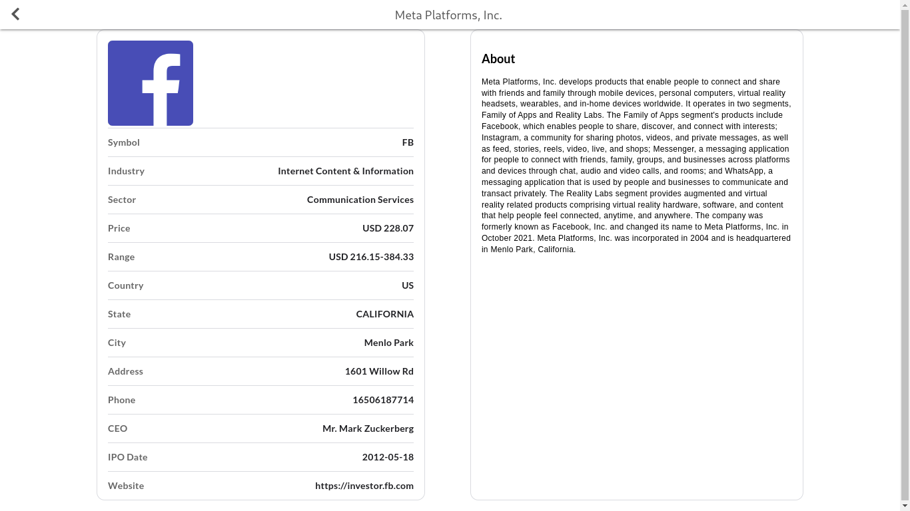

# Accurate Stock Prices
> Working with the real and live current stock exchange APIs Data. The application allows users to view current stock exchange and details for all companies - Covering NYSE, NASDAQ, AMEX, EURONEXT, TSX, INDEXES, ETFs, MUTUAL FUNDS, FOREX and CRYPTO.

## Built With

- JavaScript
- React
- Redux

## Deployed On

#### Click on the badge/button below to see the deployed version of the app:

## Getting Started

To get a local copy up and running follow these simple example steps.

### Prerequisites

- some knowledge on `npm` , webpack, JavaScript(ES6) and React
- [Node.js](https://nodejs.org/en/)
- Web browser
- Code Editor
### Setup

- Clone repository using this command in terminal ` git clone https://github.com/blessedjasonmwanza/accurate-stock-prices.git`
- Change directory to the cloned repository `cd accurate-stock-prices`
- Install dependencies using `npm install`
- run `npm start`

## Available Scripts

In the project directory, you can run:

### `npm start`

Runs the app in the development mode.\
Open [http://localhost:3000](http://localhost:3000) to view it in your browser.

The page will reload when you make changes.\
You may also see any lint errors in the console.

### `npm test`

Launches the test runner in the interactive watch mode.\
### `npm run build`

Builds the app for production to the `build` folder.\
It correctly bundles React in production mode and optimizes the build for the best performance.

The build is minified and the filenames include the hashes.\
Your app is ready to be deployed!

### `npm run eject`

**Note: this is a one-way operation. Once you `eject`, you can't go back!**

If you aren't satisfied with the build tool and configuration choices, you can `eject` at any time. This command will remove the single build dependency from your project.

Instead, it will copy all the configuration files and the transitive dependencies (webpack, Babel, ESLint, etc) right into your project so you have full control over them. All of the commands except `eject` will still work, but they will point to the copied scripts so you can tweak them. At this point you're on your own.

You don't have to ever use `eject`. The curated feature set is suitable for small and middle deployments, and you shouldn't feel obligated to use this feature. However we understand that this tool wouldn't be useful if you couldn't customize it when you are ready for it.

## Author
👤 **Blessed Jason Mwanza**

- GitHub: [@blessedjasonmwanza](https://github.com/blessedjasonmwanza)
- Twitter: [@mwanzabj](https://twitter.com/mwanzabj)
- LinkedIn: [Blessedjasonmwanza](https://linkedin.com/in/blessedjasonmwanza)
## 🤝 Contributing

Contributions, issues, and feature requests are welcome!

Feel free to check the [issues page](https://github.com/blessedjasonmwanza/accurate-stock-prices/issues).

## Show your support

Give a ⭐️ if you like this project!

## 📝 License

This project is [CREATIVE COMMONS CORPORATION](./LICENSE) licensed.

> UI Inspired by [Nelson Sakwa on Behance](https://www.behance.net/gallery/31579789/Ballhead-App-(Free-PSDs))